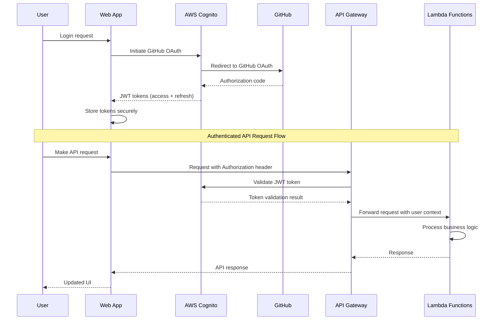

# Backend Architecture

## Service Architecture

### Function Organization (Serverless)
```
src/
├── handlers/              # Lambda function handlers
│   ├── projects/          # Project management handlers
│   │   ├── import.ts      # POST /projects
│   │   ├── list.ts        # GET /projects
│   │   └── detail.ts      # GET /projects/{id}
│   ├── templates/         # Template detection handlers
│   │   ├── detect.ts      # POST /template-detection/analyze
│   │   └── mappings.ts    # PUT /template-detection/mappings
│   ├── visualizations/    # Visualization generation handlers
│   │   ├── generate.ts    # POST /visualizations/generate
│   │   └── export.ts      # GET /visualizations/{id}/export
│   └── search/            # Search and relationship handlers
│       ├── search.ts      # GET /projects/{id}/search
│       └── relationships.ts # POST /relationships/detect
├── services/              # Business logic services
│   ├── ProjectService.ts  # Project management logic
│   ├── TemplateService.ts # Template detection and classification
│   ├── VisualizationService.ts # Mermaid generation logic
│   └── SearchService.ts   # Search and relationship analysis
├── models/                # Data access layer
│   ├── Project.ts         # Project data model
│   ├── Document.ts        # Document data model
│   └── Visualization.ts   # Visualization data model
├── utils/                 # Shared utilities
│   ├── github.ts          # GitHub API integration
│   ├── mermaid.ts         # Mermaid generation utilities
│   └── embeddings.ts      # Vector embedding utilities
└── types/                 # Shared TypeScript types
    ├── api.ts             # API request/response types
    └── domain.ts          # Domain object types
```

### Function Template
```typescript
import { APIGatewayProxyEvent, APIGatewayProxyResult } from 'aws-lambda';
import { ProjectService } from '../services/ProjectService';
import { validateRequestBody, createResponse, handleError } from '../utils/api';
import { ImportProjectRequest } from '../types/api';

export const handler = async (
  event: APIGatewayProxyEvent
): Promise<APIGatewayProxyResult> => {
  try {
    // Extract user context from JWT token
    const userId = event.requestContext.authorizer?.claims?.sub;
    if (!userId) {
      return createResponse(401, { error: 'Unauthorized' });
    }

    // Validate request body
    const body = validateRequestBody<ImportProjectRequest>(event.body);

    // Execute business logic
    const project = await ProjectService.importProject(userId, body);

    return createResponse(201, { project });
  } catch (error) {
    return handleError(error);
  }
};
```

## Database Architecture

### Schema Design
(See Database Schema section above for complete SQL definitions)

### Data Access Layer
```typescript
import { Pool } from 'pg';
import { Project, Document, TemplateZone } from '../types/domain';

export class ProjectRepository {
  private pool: Pool;

  constructor() {
    this.pool = new Pool({
      connectionString: process.env.DATABASE_URL,
      ssl: process.env.NODE_ENV === 'production' ? { rejectUnauthorized: false } : false,
    });
  }

  async createProject(userId: string, projectData: Partial<Project>): Promise<Project> {
    const query = `
      INSERT INTO projects (user_id, name, github_url, status, metadata)
      VALUES ($1, $2, $3, $4, $5)
      RETURNING *
    `;

    const values = [
      userId,
      projectData.name,
      projectData.githubUrl,
      'importing',
      JSON.stringify(projectData.metadata || {})
    ];

    const result = await this.pool.query(query, values);
    return this.mapProjectRow(result.rows[0]);
  }

  async findProjectsByUserId(userId: string): Promise<Project[]> {
    const query = `
      SELECT p.*, COUNT(d.id) as document_count
      FROM projects p
      LEFT JOIN documents d ON p.id = d.project_id
      WHERE p.user_id = $1
      GROUP BY p.id
      ORDER BY p.updated_at DESC
    `;

    const result = await this.pool.query(query, [userId]);
    return result.rows.map(this.mapProjectRow);
  }

  async searchDocuments(projectId: string, query: string, templateType?: string): Promise<Document[]> {
    const searchQuery = `
      SELECT d.*, ts_rank(to_tsvector('english', d.content), plainto_tsquery($2)) as rank
      FROM documents d
      WHERE d.project_id = $1
      AND to_tsvector('english', d.content) @@ plainto_tsquery($2)
      ${templateType ? 'AND d.template_type = $3' : ''}
      ORDER BY rank DESC
      LIMIT 20
    `;

    const values = templateType ? [projectId, query, templateType] : [projectId, query];
    const result = await this.pool.query(searchQuery, values);
    return result.rows.map(this.mapDocumentRow);
  }

  private mapProjectRow(row: any): Project {
    return {
      id: row.id,
      userId: row.user_id,
      name: row.name,
      githubUrl: row.github_url,
      status: row.status,
      metadata: row.metadata,
      createdAt: row.created_at,
      updatedAt: row.updated_at,
      documentCount: parseInt(row.document_count) || 0,
    };
  }

  private mapDocumentRow(row: any): Document {
    return {
      id: row.id,
      projectId: row.project_id,
      templateZoneId: row.template_zone_id,
      filePath: row.file_path,
      content: row.content,
      templateType: row.template_type,
      extractedMetadata: row.extracted_metadata,
      processingStatus: row.processing_status,
      detectionConfidence: parseFloat(row.detection_confidence),
      createdAt: row.created_at,
      updatedAt: row.updated_at,
    };
  }
}
```

## Authentication and Authorization

### Auth Flow


### Middleware/Guards
```typescript
import { APIGatewayProxyEvent } from 'aws-lambda';
import jwt from 'jsonwebtoken';
import jwksClient from 'jwks-rsa';

interface AuthContext {
  userId: string;
  email: string;
  permissions: string[];
}

export class AuthMiddleware {
  private jwksClient: jwksClient.JwksClient;

  constructor() {
    this.jwksClient = jwksClient({
      jwksUri: `https://cognito-idp.${process.env.AWS_REGION}.amazonaws.com/${process.env.COGNITO_USER_POOL_ID}/.well-known/jwks.json`,
      cache: true,
      cacheMaxAge: 86400000, // 24 hours
    });
  }

  async validateToken(event: APIGatewayProxyEvent): Promise<AuthContext> {
    const token = this.extractToken(event);
    if (!token) {
      throw new Error('No authorization token provided');
    }

    try {
      const decodedToken = await this.verifyJWT(token);

      return {
        userId: decodedToken.sub,
        email: decodedToken.email,
        permissions: decodedToken['custom:permissions'] || [],
      };
    } catch (error) {
      throw new Error('Invalid or expired token');
    }
  }

  private extractToken(event: APIGatewayProxyEvent): string | null {
    const authHeader = event.headers?.Authorization || event.headers?.authorization;
    if (!authHeader || !authHeader.startsWith('Bearer ')) {
      return null;
    }
    return authHeader.substring(7);
  }

  private async verifyJWT(token: string): Promise<any> {
    const decodedHeader = jwt.decode(token, { complete: true });
    if (!decodedHeader || typeof decodedHeader === 'string') {
      throw new Error('Invalid token format');
    }

    const kid = decodedHeader.header.kid;
    const key = await this.jwksClient.getSigningKey(kid);
    const signingKey = key.getPublicKey();

    return jwt.verify(token, signingKey, {
      algorithms: ['RS256'],
      issuer: `https://cognito-idp.${process.env.AWS_REGION}.amazonaws.com/${process.env.COGNITO_USER_POOL_ID}`,
    });
  }
}

// Usage in Lambda handlers
export const requireAuth = (handler: Function) => {
  return async (event: APIGatewayProxyEvent, context: any) => {
    const authMiddleware = new AuthMiddleware();

    try {
      const authContext = await authMiddleware.validateToken(event);

      // Add auth context to event for use in handler
      (event as any).authContext = authContext;

      return handler(event, context);
    } catch (error) {
      return {
        statusCode: 401,
        body: JSON.stringify({ error: error.message }),
      };
    }
  };
};
```
