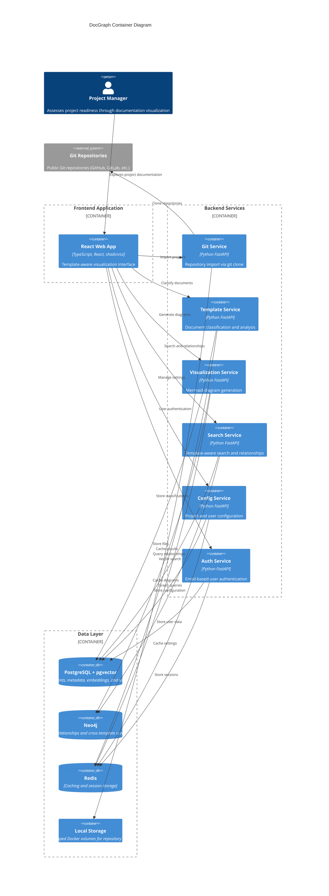

# Components

## Git Repository Service
**Responsibility:** Handles repository import and file synchronization via direct git operations

**Key Interfaces:**
- POST /projects - Import repository from public Git URL
- GET /projects/{id}/sync - Refresh repository content via git pull
- Git clone and file system operations

**Dependencies:** Local file storage, PostgreSQL with pgvector (project metadata), Git CLI tools

**Technology Stack:** Python FastAPI, GitPython for git operations, local file system storage, asyncio for concurrent processing

## Template Detection Service
**Responsibility:** Analyzes imported documents to classify template types and extract metadata patterns

**Key Interfaces:**
- POST /template-detection/analyze - Process documents for template classification
- GET /template-detection/rules - Retrieve template matching rules
- PUT /template-detection/mappings - Update project-specific template mappings

**Dependencies:** PostgreSQL with pgvector (document storage and embeddings), Redis (caching), Machine Learning models for pattern recognition

**Technology Stack:** Python FastAPI, scikit-learn for classification, spaCy for NLP processing, custom pattern matching engines

## Visualization Generation Service
**Responsibility:** Creates Mermaid diagrams from template-classified documents and relationships

**Key Interfaces:**
- POST /visualizations/generate - Create new visualization from project data
- GET /visualizations/{id}/export - Export visualization in various formats
- PUT /visualizations/{id}/config - Update visualization styling and layout

**Dependencies:** Neo4j (relationship queries), Redis (diagram caching), Mermaid.js (diagram generation)

**Technology Stack:** Python FastAPI, Neo4j driver for graph processing, Puppeteer for diagram rendering, custom Mermaid template engines

## Search & Relationship Service
**Responsibility:** Provides template-aware search and cross-template relationship detection

**Key Interfaces:**
- GET /projects/{id}/search - Template-aware document search
- POST /relationships/detect - Analyze cross-template connections
- GET /relationships/{id} - Retrieve relationship details with metadata

**Dependencies:** PostgreSQL with pgvector (similarity search), Neo4j (relationship storage), Template Detection Service

**Technology Stack:** Python FastAPI, pgvector for embedding search, sentence-transformers for document embeddings, custom relationship analysis algorithms

## Project Configuration Service
**Responsibility:** Manages project settings, template mappings, and user preferences

**Key Interfaces:**
- GET/PUT /projects/{id}/config - Project configuration management
- POST /projects/{id}/template-mappings - Update template detection rules
- GET /users/{id}/preferences - User-specific configuration settings

**Dependencies:** PostgreSQL with pgvector (configuration and user storage), Redis (session caching)

**Technology Stack:** Python FastAPI, SQLAlchemy ORM, Pydantic for configuration validation, custom template mapping logic

## User Management Service
**Responsibility:** Handles basic email-based user registration, authentication, and session management

**Key Interfaces:**
- POST /auth/register - User registration with email
- POST /auth/login - User login authentication
- POST /auth/logout - User logout and session cleanup
- GET /auth/profile - User profile information

**Dependencies:** PostgreSQL with pgvector (user storage), Redis (session storage), bcrypt for password hashing, JWT for session tokens

**Technology Stack:** Python FastAPI, SQLAlchemy ORM, bcrypt for password security, PyJWT for token management

## Component Diagrams

