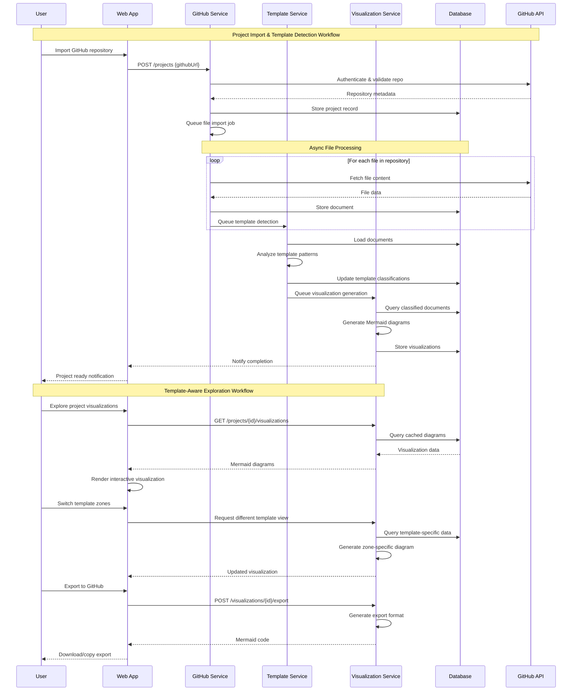

# Core Workflows

```mermaid
sequenceDiagram
    participant U as User
    participant W as Web App
    participant G as GitHub Service
    participant T as Template Service
    participant V as Visualization Service
    participant DB as Database
    participant GH as GitHub API

    Note over U,GH: Project Import & Template Detection Workflow

    U->>W: Import GitHub repository
    W->>G: POST /projects {githubUrl}
    G->>GH: Authenticate & validate repo
    GH-->>G: Repository metadata
    G->>DB: Store project record
    G->>G: Queue file import job

    Note over G,DB: Async File Processing
    loop For each file in repository
        G->>GH: Fetch file content
        GH-->>G: File data
        G->>DB: Store document
        G->>T: Queue template detection
    end

    T->>DB: Load documents
    T->>T: Analyze template patterns
    T->>DB: Update template classifications
    T->>V: Queue visualization generation

    V->>DB: Query classified documents
    V->>V: Generate Mermaid diagrams
    V->>DB: Store visualizations
    V-->>W: Notify completion

    W-->>U: Project ready notification

    Note over U,V: Template-Aware Exploration Workflow

    U->>W: Explore project visualizations
    W->>V: GET /projects/{id}/visualizations
    V->>DB: Query cached diagrams
    DB-->>V: Visualization data
    V-->>W: Mermaid diagrams
    W->>W: Render interactive visualization

    U->>W: Switch template zones
    W->>V: Request different template view
    V->>DB: Query template-specific data
    V->>V: Generate zone-specific diagram
    V-->>W: Updated visualization

    U->>W: Export to GitHub
    W->>V: POST /visualizations/{id}/export
    V->>V: Generate export format
    V-->>W: Mermaid code
    W-->>U: Download/copy export
```
