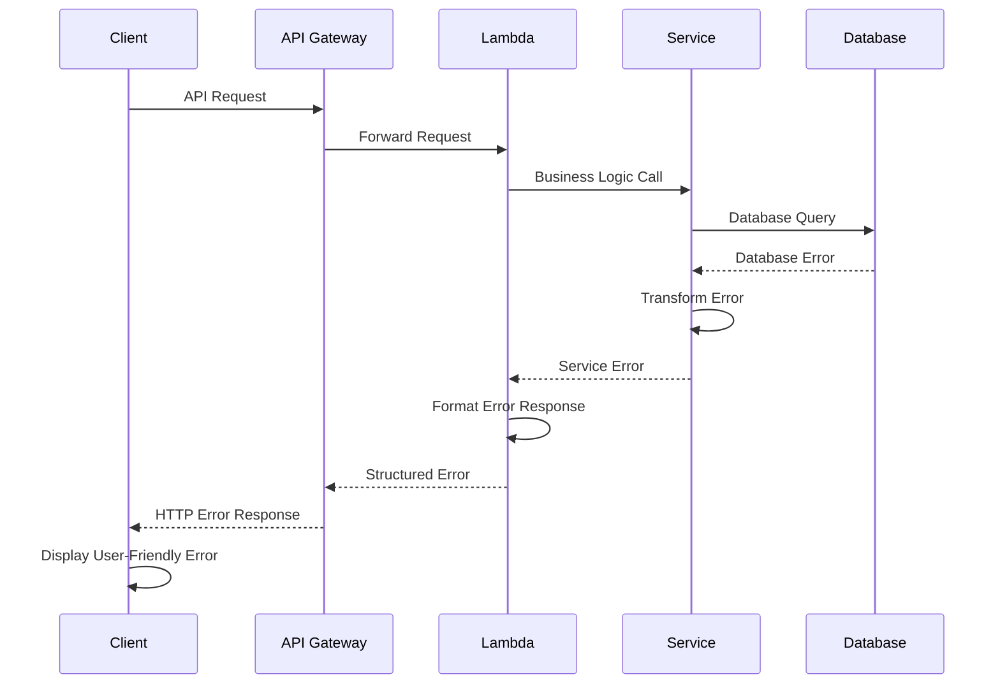

# Error Handling Strategy

## Error Flow


## Error Response Format
```typescript
interface ApiError {
  error: {
    code: string;           // Machine-readable error code
    message: string;        // Human-readable error message
    details?: Record<string, any>; // Additional error context
    timestamp: string;      // ISO 8601 timestamp
    requestId: string;      // Correlation ID for debugging
    path?: string;          // API endpoint that failed
    statusCode: number;     // HTTP status code
  };
}

// Example error responses
const examples = {
  validation: {
    error: {
      code: 'VALIDATION_ERROR',
      message: 'Invalid request parameters',
      details: {
        field: 'githubUrl',
        constraint: 'Must be a valid GitHub repository URL'
      },
      timestamp: '2025-09-24T10:30:00.000Z',
      requestId: 'req-123456789',
      path: '/api/projects',
      statusCode: 400
    }
  },
  notFound: {
    error: {
      code: 'RESOURCE_NOT_FOUND',
      message: 'Project not found',
      details: {
        resourceType: 'project',
        resourceId: 'project-123'
      },
      timestamp: '2025-09-24T10:30:00.000Z',
      requestId: 'req-123456789',
      path: '/api/projects/project-123',
      statusCode: 404
    }
  },
  serverError: {
    error: {
      code: 'INTERNAL_SERVER_ERROR',
      message: 'An unexpected error occurred',
      timestamp: '2025-09-24T10:30:00.000Z',
      requestId: 'req-123456789',
      path: '/api/visualizations/generate',
      statusCode: 500
    }
  }
};
```

## Frontend Error Handling
```typescript
import { toast } from '@/components/ui/use-toast';
import { ApiError } from '@/types/api';

class ErrorHandler {
  static handleApiError(error: ApiError, context?: string) {
    const { code, message, details } = error.error;

    // Log error for debugging
    console.error(`API Error [${code}]:`, {
      message,
      details,
      context,
      requestId: error.error.requestId
    });

    // Show user-friendly error message
    switch (code) {
      case 'VALIDATION_ERROR':
        toast({
          title: 'Invalid Input',
          description: message,
          variant: 'destructive',
        });
        break;

      case 'RESOURCE_NOT_FOUND':
        toast({
          title: 'Not Found',
          description: 'The requested resource could not be found.',
          variant: 'destructive',
        });
        break;

      case 'RATE_LIMIT_EXCEEDED':
        toast({
          title: 'Rate Limit Exceeded',
          description: 'Please wait before making another request.',
          variant: 'destructive',
        });
        break;

      case 'INTERNAL_SERVER_ERROR':
      default:
        toast({
          title: 'Something went wrong',
          description: 'Please try again later or contact support.',
          variant: 'destructive',
        });

        // Report to error monitoring service
        this.reportError(error, context);
        break;
    }
  }

  static reportError(error: ApiError, context?: string) {
    // Send to monitoring service (DataDog, Sentry, etc.)
    if (typeof window !== 'undefined' && window.datadog) {
      window.datadog.addError(error, {
        context,
        requestId: error.error.requestId,
        userAgent: navigator.userAgent,
        url: window.location.href
      });
    }
  }

  static handleNetworkError(error: Error) {
    console.error('Network Error:', error);

    toast({
      title: 'Connection Error',
      description: 'Please check your internet connection and try again.',
      variant: 'destructive',
    });
  }
}

// Usage in API service
export class ApiService {
  async request<T>(config: RequestConfig): Promise<T> {
    try {
      const response = await this.httpClient.request(config);
      return response.data;
    } catch (error) {
      if (error.response) {
        // Server responded with error
        ErrorHandler.handleApiError(error.response.data, config.url);
      } else if (error.request) {
        // Network error
        ErrorHandler.handleNetworkError(error);
      } else {
        // Request setup error
        console.error('Request Error:', error.message);
      }
      throw error;
    }
  }
}
```

## Backend Error Handling
```python
import logging
import uuid
from datetime import datetime
from typing import Optional, Dict, Any
from fastapi import HTTPException
from fastapi.responses import JSONResponse

# Custom exception classes
class DocGraphError(Exception):
    def __init__(self, code: str, message: str, details: Optional[Dict] = None, status_code: int = 500):
        self.code = code
        self.message = message
        self.details = details or {}
        self.status_code = status_code
        super().__init__(message)

class ValidationError(DocGraphError):
    def __init__(self, message: str, field: str, constraint: str):
        super().__init__(
            code='VALIDATION_ERROR',
            message=message,
            details={'field': field, 'constraint': constraint},
            status_code=400
        )

class ResourceNotFoundError(DocGraphError):
    def __init__(self, resource_type: str, resource_id: str):
        super().__init__(
            code='RESOURCE_NOT_FOUND',
            message=f'{resource_type.title()} not found',
            details={'resourceType': resource_type, 'resourceId': resource_id},
            status_code=404
        )

class RateLimitError(DocGraphError):
    def __init__(self, limit: int, window: str):
        super().__init__(
            code='RATE_LIMIT_EXCEEDED',
            message=f'Rate limit of {limit} requests per {window} exceeded',
            details={'limit': limit, 'window': window},
            status_code=429
        )

# Error handler middleware
class ErrorHandler:
    @staticmethod
    def create_error_response(
        code: str,
        message: str,
        status_code: int = 500,
        details: Optional[Dict] = None,
        path: Optional[str] = None,
        request_id: Optional[str] = None
    ) -> JSONResponse:
        error_data = {
            'error': {
                'code': code,
                'message': message,
                'timestamp': datetime.utcnow().isoformat() + 'Z',
                'requestId': request_id or str(uuid.uuid4()),
                'statusCode': status_code
            }
        }

        if details:
            error_data['error']['details'] = details
        if path:
            error_data['error']['path'] = path

        # Log error for monitoring
        logging.error(f"API Error [{code}]: {message}", extra={
            'error_code': code,
            'status_code': status_code,
            'details': details,
            'request_id': error_data['error']['requestId'],
            'path': path
        })

        return JSONResponse(
            status_code=status_code,
            content=error_data
        )

    @staticmethod
    def handle_docgraph_error(error: DocGraphError, path: str, request_id: str) -> JSONResponse:
        return ErrorHandler.create_error_response(
            code=error.code,
            message=error.message,
            status_code=error.status_code,
            details=error.details,
            path=path,
            request_id=request_id
        )

    @staticmethod
    def handle_unexpected_error(error: Exception, path: str, request_id: str) -> JSONResponse:
        # Log full exception for debugging
        logging.exception(f"Unexpected error in {path}", extra={
            'request_id': request_id,
            'path': path,
            'error_type': type(error).__name__
        })

        return ErrorHandler.create_error_response(
            code='INTERNAL_SERVER_ERROR',
            message='An unexpected error occurred',
            status_code=500,
            path=path,
            request_id=request_id
        )

# Usage in Lambda handlers
def lambda_handler(event, context):
    request_id = str(uuid.uuid4())
    path = event.get('path', '')

    try:
        # Business logic here
        result = process_request(event)
        return {
            'statusCode': 200,
            'body': json.dumps(result),
            'headers': {
                'Content-Type': 'application/json',
                'X-Request-ID': request_id
            }
        }

    except DocGraphError as e:
        return ErrorHandler.handle_docgraph_error(e, path, request_id).body

    except Exception as e:
        return ErrorHandler.handle_unexpected_error(e, path, request_id).body

# Usage in service classes
class ProjectService:
    def get_project(self, project_id: str, user_id: str) -> Project:
        project = self.repository.find_by_id(project_id)

        if not project:
            raise ResourceNotFoundError('project', project_id)

        if project.user_id != user_id:
            raise DocGraphError(
                code='FORBIDDEN',
                message='Access denied to this project',
                status_code=403
            )

        return project

    def import_project(self, user_id: str, github_url: str, name: str) -> Project:
        # Validate GitHub URL
        if not self._is_valid_github_url(github_url):
            raise ValidationError(
                message='Invalid GitHub repository URL',
                field='githubUrl',
                constraint='Must be a valid GitHub repository URL'
            )

        # Check rate limits
        if self._is_rate_limited(user_id):
            raise RateLimitError(limit=10, window='hour')

        # Process import
        return self._create_project(user_id, github_url, name)
```
