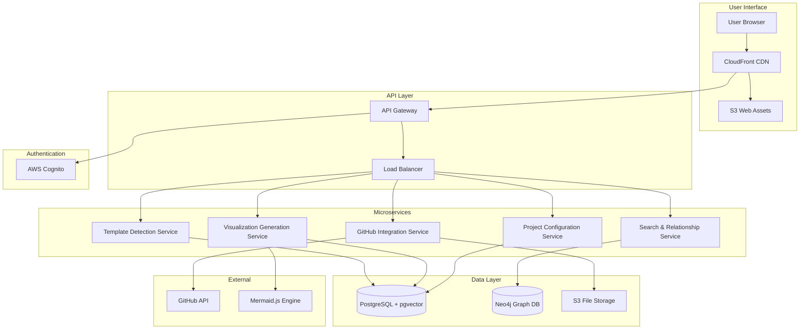

# High Level Architecture

## Technical Summary

DocGraph implements a microservices architecture within a monorepo structure, featuring a React + shadcn/ui frontend with Python FastAPI backend services deployed on cloud infrastructure. The system specializes in template-aware document processing with dedicated services for GitHub integration, template detection, Mermaid visualization generation, and cross-template relationship analysis. Key integration points include a unified TypeScript type system, RESTful APIs with OpenAPI specifications, and hybrid database architecture using pgvector for document embeddings and Neo4j for graph relationships. This architecture achieves the PRD's performance goals through intelligent caching, progressive rendering, and specialized template processing pipelines optimized for BMAD-METHOD and Claude Code documentation structures.

## Platform and Infrastructure Choice

**Platform:** AWS Cloud Platform
**Key Services:** Lambda Functions (serverless compute), API Gateway (routing), S3 (file storage), CloudFront (CDN), RDS PostgreSQL with pgvector (document embeddings), Neo4j AuraDB (graph relationships), Cognito (authentication)
**Deployment Host and Regions:** Primary: us-east-1, Secondary: eu-west-1 for global CDN distribution

**Rationale:** AWS provides comprehensive serverless ecosystem with excellent GitHub integration capabilities, mature ML/AI services for template detection enhancement, and proven scalability for document processing workloads. Neo4j AuraDB cloud service eliminates infrastructure complexity while providing specialized graph database capabilities essential for cross-template relationship mapping.

## Repository Structure

**Structure:** Monorepo with clear frontend/backend separation
**Monorepo Tool:** Nx with integrated build caching and dependency graph management
**Package Organization:** Apps (web, api) + Packages (shared types, UI components, template engines, database clients) + Infrastructure (AWS CDK definitions)

## High Level Architecture Diagram

## Architectural Patterns

- **Microservices Architecture:** Specialized services for template detection, visualization, and data processing - *Rationale:* Clear separation of concerns enables independent scaling and optimization of complex template processing logic
- **Event-Driven Processing:** Asynchronous document processing with SQS queues - *Rationale:* Handles large repository imports without blocking user interface, enables progressive loading
- **CQRS Pattern:** Separate read/write models for document querying vs. processing - *Rationale:* Optimizes performance for complex graph queries while maintaining simple write operations
- **Template Strategy Pattern:** Pluggable template detection engines for BMAD-METHOD, Claude Code, and future frameworks - *Rationale:* Enables extensibility without core system modification
- **Graph-First Data Modeling:** Neo4j for relationships, PostgreSQL for documents - *Rationale:* Matches the natural structure of cross-template documentation relationships
- **Progressive Enhancement:** Client-side rendering with server-side fallbacks - *Rationale:* Ensures performance for complex visualizations while maintaining accessibility
