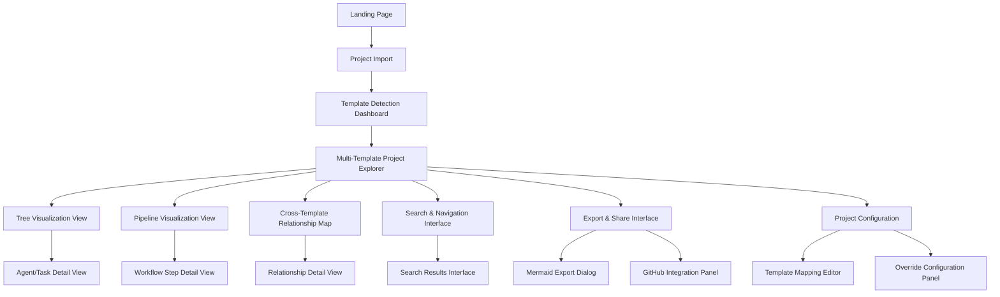
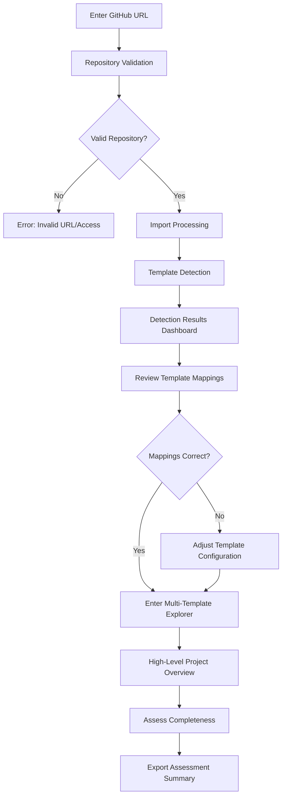
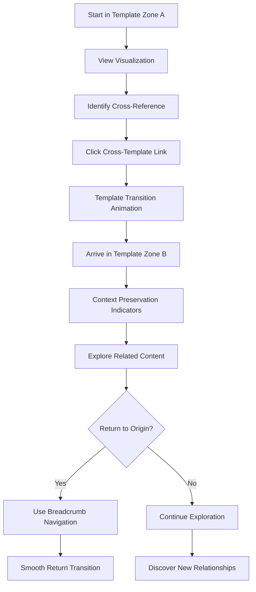
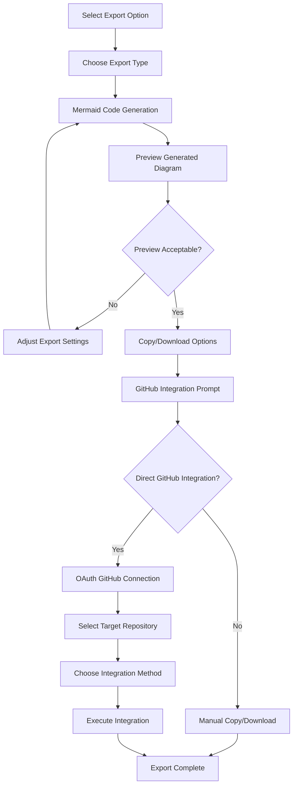

# DocGraph UI/UX Specification

## Introduction

This document defines the user experience goals, information architecture, user flows, and visual design specifications for DocGraph's user interface. It serves as the foundation for visual design and frontend development, ensuring a cohesive and user-centered experience focused on template-aware documentation exploration.

### Overall UX Goals & Principles

#### Target User Personas

**Primary Persona - Project Decision Makers**
Technical leaders (Project Managers, Product Managers, Technical Architects) who need to rapidly assess project development readiness through documentation completeness. They value efficiency, confidence in decisions, and clear visual communication of complex relationships. Key behaviors: scanning for completeness, identifying gaps, communicating status to stakeholders.

**Secondary Persona - Development Teams**
Developers, DevOps engineers, and QA professionals who need to understand project structure for implementation planning. They prioritize context preservation, quick navigation, and detailed technical information accessibility. Key behaviors: tracing dependencies, understanding workflows, onboarding to new projects.

#### Usability Goals

- **Immediate Comprehension**: Users understand project structure within 60 seconds of viewing visualizations
- **Confident Decision-Making**: 85% of users feel confident making go/no-go decisions after 15-minute exploration
- **Context Preservation**: Users maintain orientation across template zones without losing their analysis thread
- **Template Recognition**: Users instantly recognize different template types through visual differentiation
- **Export Efficiency**: Mermaid diagram exports generate in under 5 seconds with GitHub-ready formatting
- **Navigation Fluidity**: Cross-template navigation maintains mental model coherence across framework boundaries

#### Design Principles

1. **Template-First Clarity** - Every interface element immediately communicates which template context the user is exploring
2. **Progressive Visual Disclosure** - Start with high-level overviews, allow drilling into details without losing context
3. **Relationship-Centric Design** - Connections and dependencies are visually prominent and easy to follow
4. **Mermaid-Native Patterns** - All visualizations follow Mermaid conventions for immediate recognition and export fidelity
5. **Cross-Template Coherence** - Unified visual language maintains usability while clearly distinguishing template zones

### Change Log
| Date | Version | Description | Author |
|------|---------|-------------|--------|
| 2025-09-24 | 1.0 | Initial UI/UX specification creation | UX Expert Sally |

## Information Architecture (IA)

### Site Map / Screen Inventory

### Navigation Structure

**Primary Navigation**: Template-aware top navigation with visual indicators for current template zone (BMAD-METHOD, Claude Code, Generic). Includes project switcher, main view toggles (Tree/Pipeline/Cross-Template), and export actions.

**Secondary Navigation**: Context-sensitive sidebar showing hierarchical navigation within current template zone. Breadcrumb trail maintains cross-template navigation history with template zone indicators.

**Breadcrumb Strategy**: Multi-level breadcrumbs showing: Project → Template Zone → Current Section → Detail Level, with visual template zone badges for quick orientation and one-click zone switching.

## User Flows

### Flow 1: Initial Project Import & Assessment

**User Goal**: Import the Magnet project repository and quickly assess its documentation completeness for development readiness.

**Entry Points**: Landing page CTA, direct URL with repository parameter

**Success Criteria**: User confidently determines project development readiness within 15 minutes

#### Flow Diagram

#### Edge Cases & Error Handling:
- Private repository access denied → Clear OAuth prompt with scope explanation
- Large repository timeout → Progress indicators with partial loading capabilities
- Malformed template detection → Manual override options with guidance
- Network interruption during import → Resume capability with progress preservation

**Notes**: This flow establishes the foundational user experience and validates DocGraph's core value proposition with real project assessment.

### Flow 2: Template-Aware Visualization Exploration

**User Goal**: Navigate between BMAD-METHOD documentation and Claude Code configuration while maintaining context of their relationship analysis.

**Entry Points**: Multi-Template Project Explorer, search results, direct links

**Success Criteria**: User maintains context across template zones and discovers cross-template relationships

#### Flow Diagram

#### Edge Cases & Error Handling:
- Broken cross-template references → Clear error indication with alternative navigation
- Deep navigation stack overflow → Smart breadcrumb condensation
- Template zone confusion → Prominent template indicators and "Where am I?" help
- Performance degradation → Progressive loading with skeleton states

**Notes**: This flow is critical for DocGraph's differentiation - seamless cross-template navigation while preserving user mental models.

### Flow 3: Mermaid Export & GitHub Integration

**User Goal**: Export visualization insights as Mermaid diagrams for GitHub documentation or stakeholder communication.

**Entry Points**: Export buttons throughout interface, batch export options

**Success Criteria**: User successfully exports and integrates diagrams in external documentation within 2 minutes

#### Flow Diagram

#### Edge Cases & Error Handling:
- Mermaid generation failure → Fallback export formats with clear error messaging
- GitHub integration API errors → Graceful fallback to manual export with troubleshooting guidance
- Large diagram export timeout → Progressive generation with partial export options
- Invalid GitHub permissions → Clear permission requirements with re-authorization flow

**Notes**: Export functionality is essential for DocGraph's integration into existing workflows and stakeholder communication.

## Wireframes & Mockups

**Primary Design Files**: Figma workspace at [DocGraph Design System - TBD]

### Key Screen Layouts

#### Multi-Template Project Explorer
**Purpose**: Central hub for template-aware project exploration with unified navigation and visualization switching

**Key Elements**:
- Template zone indicator bar with color-coded sections (BMAD=blue, Claude Code=green, Generic=gray)
- Visualization type toggle (Tree/Pipeline/Cross-Template) with preview thumbnails
- Project metadata panel showing import date, template detection confidence, completeness metrics
- Context-sensitive navigation sidebar adapting to current template zone
- Main visualization canvas with zoom, pan, and export controls
- Cross-template relationship highlights overlaid on visualizations

**Interaction Notes**: Hover states reveal relationship details, click-to-drill into specific nodes, smooth template zone transitions with visual continuity

**Design File Reference**: [Frame: Multi-Template Explorer - TBD]

#### Tree Visualization View
**Purpose**: Display hierarchical relationships within Claude Code .bmad-core structures and BMAD-METHOD directory hierarchies

**Key Elements**:
- Mermaid-rendered tree diagram with interactive nodes
- Expandable/collapsible branches with visual state indicators
- Node detail overlay on hover/click with metadata and relationships
- Template-specific styling (agents=circles, tasks=rectangles, templates=diamonds)
- Relationship strength indicators through line weight and color
- Export controls with live Mermaid code preview

**Interaction Notes**: Click-to-expand maintains visual stability, right-click context menu for node actions, keyboard navigation support

**Design File Reference**: [Frame: Tree Visualization - TBD]

#### Pipeline Visualization View
**Purpose**: Show sequential workflow progression for BMAD-METHOD documentation stages and process flows

**Key Elements**:
- Horizontal Mermaid pipeline with completion status indicators
- Stage detail panels showing document metadata, completion status, dependencies
- Cross-stage relationship connectors with dependency types
- Progress indicators showing workflow completeness percentage
- Timeline view toggle showing chronological progression
- Stage-specific actions (view document, check dependencies, export stage)

**Interaction Notes**: Click stages for detail view, drag timeline slider for historical views, export individual stages or complete pipeline

**Design File Reference**: [Frame: Pipeline Visualization - TBD]

#### Template Detection Dashboard
**Purpose**: Review and configure automatic template detection results with override capabilities

**Key Elements**:
- Detection confidence matrix showing template assignments with confidence scores
- Override interface for correcting misclassified documents
- Template mapping rules editor with pattern preview
- Detection statistics showing coverage and accuracy metrics
- Validation warnings for conflicts or missing patterns
- Save/export configuration options for reuse

**Interaction Notes**: Drag-and-drop for template reassignment, inline editing for mapping rules, real-time validation feedback

**Design File Reference**: [Frame: Template Detection - TBD]

## Component Library / Design System

**Design System Approach**: Custom design system built on shadcn/ui foundation, extended with DocGraph-specific components for template-aware visualization and Mermaid integration.

### Core Components

#### TemplateZoneIndicator
**Purpose**: Visual indicator showing current template context with quick switching capabilities

**Variants**: Badge (compact), Bar (full-width), Breadcrumb (navigation)

**States**: Active, Inactive, Transitioning, Error

**Usage Guidelines**: Always visible during template exploration, color-coded by template type, includes confidence indicators for detected templates

#### MermaidVisualization
**Purpose**: Container component for rendering and interacting with Mermaid diagrams

**Variants**: Tree, Pipeline, Graph, Flowchart

**States**: Loading, Rendered, Error, Exporting

**Usage Guidelines**: Maintains aspect ratio, supports zoom/pan gestures, includes export controls, handles progressive loading for large diagrams

#### CrossTemplateLink
**Purpose**: Interactive element indicating relationships between different template zones

**Variants**: Inline (within text), Visual (on diagrams), Navigation (breadcrumbs)

**States**: Default, Hover, Active, Visited, Broken

**Usage Guidelines**: Distinctive styling from regular links, includes template destination indicators, smooth transition animations

#### RelationshipViewer
**Purpose**: Detail panel showing connections and dependencies between documentation elements

**Variants**: Compact (sidebar), Expanded (modal), Inline (overlay)

**States**: Loading, Populated, Empty, Error

**Usage Guidelines**: Context-sensitive content, supports nested relationships, includes strength indicators and metadata

#### ExportDialog
**Purpose**: Interface for generating and downloading Mermaid diagrams with format options

**Variants**: Quick (single diagram), Batch (multiple), Integration (GitHub)

**States**: Setup, Generating, Preview, Complete, Error

**Usage Guidelines**: Format preview before export, progress indicators for generation, integration options clearly labeled

## Branding & Style Guide

### Visual Identity
**Brand Guidelines**: Professional, technical documentation tool aesthetic with emphasis on clarity and systematic organization. Clean, modern interface that doesn't compete with content visualization.

### Color Palette
| Color Type | Hex Code | Usage |
|------------|----------|--------|
| Primary | #2563EB | Template zone indicators, primary actions, focus states |
| Secondary | #10B981 | Success states, completion indicators, positive feedback |
| Accent | #F59E0B | Warnings, attention states, export actions |
| Success | #059669 | Successful operations, valid configurations |
| Warning | #D97706 | Template conflicts, attention needed |
| Error | #DC2626 | Errors, invalid configurations, broken links |
| Neutral | #6B7280, #F3F4F6, #1F2937 | Text hierarchy, borders, backgrounds |

**Template Zone Colors**:
- BMAD-METHOD: #3B82F6 (Blue)
- Claude Code: #10B981 (Green)
- Generic: #6B7280 (Gray)
- Cross-Template: #8B5CF6 (Purple)

### Typography

#### Font Families
- **Primary**: Inter (UI elements, labels, body text)
- **Secondary**: JetBrains Mono (code, technical details, Mermaid syntax)
- **Monospace**: JetBrains Mono (terminal, configuration, export code)

#### Type Scale
| Element | Size | Weight | Line Height |
|---------|------|--------|-------------|
| H1 | 32px | 700 | 1.2 |
| H2 | 24px | 600 | 1.3 |
| H3 | 20px | 600 | 1.4 |
| Body | 16px | 400 | 1.5 |
| Small | 14px | 400 | 1.4 |
| Code | 14px | 400 | 1.4 |

### Iconography
**Icon Library**: Lucide React for consistency with shadcn/ui, supplemented with custom template-aware icons

**Usage Guidelines**:
- Template type icons: distinct symbols for BMAD-METHOD (document-stack), Claude Code (cpu), Generic (folder)
- Relationship type icons: arrows for dependencies, links for references, bridges for cross-template connections
- Action icons: export (download), configuration (settings), navigation (chevrons)

### Spacing & Layout
**Grid System**: 8px base unit with 4px, 8px, 16px, 24px, 32px, 48px, 64px spacing scale

**Spacing Scale**: Consistent spacing using CSS custom properties based on 8px grid system for vertical rhythm and horizontal alignment

## Accessibility Requirements

### Compliance Target
**Standard**: WCAG 2.1 AA compliance with enhanced keyboard navigation for complex visualizations

### Key Requirements

**Visual:**
- Color contrast ratios: 4.5:1 for normal text, 3:1 for large text, enhanced contrast mode available
- Focus indicators: High-contrast 2px outline with 2px offset, persistent during keyboard navigation
- Text sizing: Scalable up to 200% without horizontal scrolling, relative units throughout

**Interaction:**
- Keyboard navigation: Full keyboard access to all interactive elements, logical tab order, visual focus indicators
- Screen reader support: ARIA labels for complex visualizations, live regions for dynamic content, semantic markup
- Touch targets: Minimum 44px touch targets, adequate spacing between interactive elements

**Content:**
- Alternative text: Descriptive alt text for all diagrams, structured data for screen readers
- Heading structure: Logical heading hierarchy (h1-h6), consistent structure across template zones
- Form labels: Clear labels for all form controls, error messages associated with inputs

### Testing Strategy
Automated testing with axe-core, manual testing with keyboard-only navigation, screen reader testing with NVDA/JAWS, color contrast validation, usability testing with users who have disabilities.

## Responsiveness Strategy

### Breakpoints
| Breakpoint | Min Width | Max Width | Target Devices |
|------------|-----------|-----------|----------------|
| Mobile | 320px | 767px | Smartphones, small tablets |
| Tablet | 768px | 1023px | Tablets, small laptops |
| Desktop | 1024px | 1439px | Laptops, desktop monitors |
| Wide | 1440px | - | Large monitors, ultrawide displays |

### Adaptation Patterns

**Layout Changes**: Mobile-first responsive design with progressive enhancement. Complex visualizations adapt through simplified views and progressive disclosure.

**Navigation Changes**: Collapsible sidebar on mobile, hamburger menu for template zone switching, breadcrumbs collapse to current location with expandable history.

**Content Priority**: Mobile focuses on single template visualization, desktop enables side-by-side template comparison, wide screens support multiple concurrent visualizations.

**Interaction Changes**: Touch-optimized controls on mobile, hover states for desktop, gesture support for visualization manipulation (pinch-to-zoom, pan).

## Animation & Micro-interactions

### Motion Principles
Purposeful motion that supports user comprehension of template relationships and state changes. Animations respect prefers-reduced-motion settings and provide clear feedback for user actions.

### Key Animations
- **Template Zone Transition**: Smooth sliding transition with color fade (400ms, ease-out)
- **Visualization Loading**: Progressive reveal with skeleton states (200ms stagger, ease-in)
- **Node Expansion**: Scale and opacity animation for tree branches (300ms, ease-out)
- **Cross-Template Link Hover**: Subtle glow and connection line animation (150ms, ease-in-out)
- **Export Generation**: Progress indicator with completion celebration (Variable duration, linear)
- **Error States**: Gentle shake animation for invalid inputs (250ms, ease-in-out)
- **Search Results**: Staggered fade-in for results list (100ms stagger, ease-out)

## Performance Considerations

### Performance Goals
- **Page Load**: Initial page render under 1.5 seconds on 3G connection
- **Visualization Render**: Mermaid diagram generation under 2 seconds for 1000+ files
- **Interaction Response**: UI interactions respond within 100ms
- **Animation FPS**: Maintain 60fps during transitions and interactions

### Design Strategies
Progressive loading with skeleton states, lazy loading for off-screen visualizations, image optimization for exported diagrams, code splitting for template-specific functionality, virtualization for large tree structures, caching strategy for frequently accessed diagrams.

## Next Steps

### Immediate Actions
1. Create detailed visual mockups in Figma with component specifications
2. Develop interactive prototype for user testing with Magnet project data
3. Conduct usability testing sessions with target personas
4. Define detailed component API specifications for development handoff
5. Create accessibility audit checklist and testing procedures
6. Establish design token system and CSS custom properties
7. Document animation specifications with timing and easing functions

### Design Handoff Checklist
- [x] All user flows documented with edge cases
- [x] Component inventory complete with states and variants
- [x] Accessibility requirements defined with testing strategy
- [x] Responsive strategy clear with breakpoint specifications
- [x] Brand guidelines incorporated with template-specific styling
- [x] Performance goals established with measurement criteria
- [x] Animation specifications detailed with implementation guidance
- [ ] Visual mockups created in design tool
- [ ] Interactive prototype validated with user testing
- [ ] Component specifications ready for development
- [ ] Design token system implemented
- [ ] Accessibility audit completed

## Checklist Results

*This section will be populated after running the UI/UX checklist against this document to validate completeness and design quality.*