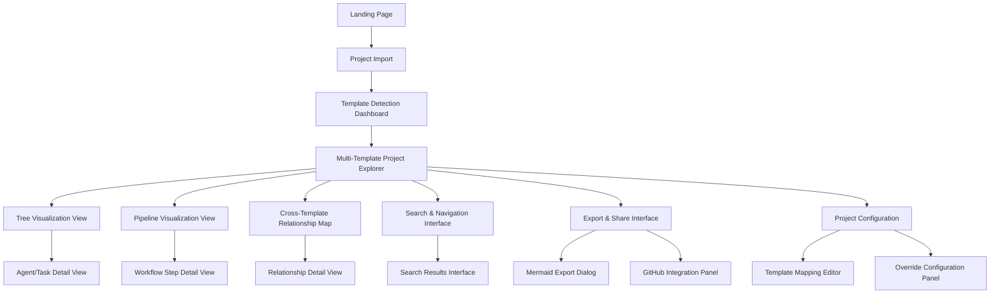

# Information Architecture (IA)

## Site Map / Screen Inventory

## Navigation Structure

**Primary Navigation**: Template-aware top navigation with visual indicators for current template zone (BMAD-METHOD, Claude Code, Generic). Includes project switcher, main view toggles (Tree/Pipeline/Cross-Template), and export actions.

**Secondary Navigation**: Context-sensitive sidebar showing hierarchical navigation within current template zone. Breadcrumb trail maintains cross-template navigation history with template zone indicators.

**Breadcrumb Strategy**: Multi-level breadcrumbs showing: Project → Template Zone → Current Section → Detail Level, with visual template zone badges for quick orientation and one-click zone switching.
