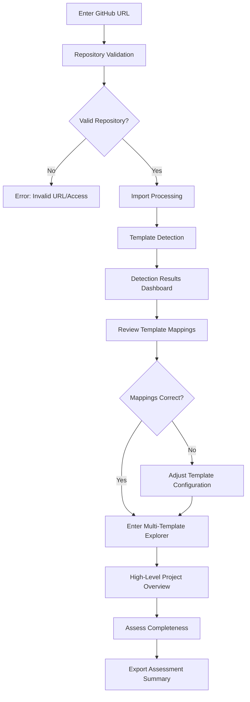
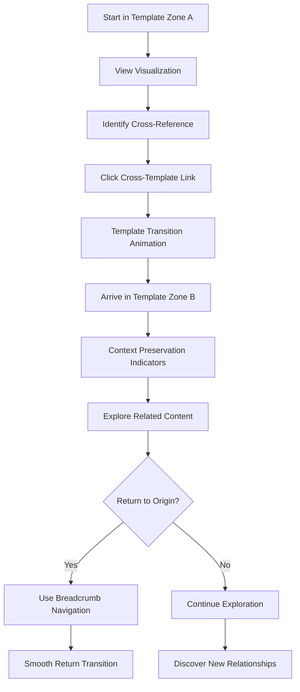
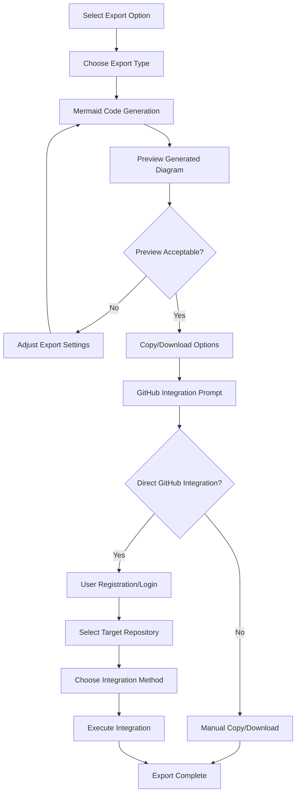

# User Flows

## Flow 1: Initial Project Import & Assessment

**User Goal**: Import the Magnet project repository and quickly assess its documentation completeness for development readiness.

**Entry Points**: Landing page CTA, direct URL with repository parameter

**Success Criteria**: User confidently determines project development readiness within 15 minutes

### Flow Diagram

### Edge Cases & Error Handling:
- Private repository access denied → Clear message explaining public repository requirement
- Large repository timeout → Progress indicators with partial loading capabilities
- Malformed template detection → Manual override options with guidance
- Network interruption during import → Resume capability with progress preservation

**Notes**: This flow establishes the foundational user experience and validates DocGraph's core value proposition with real project assessment.

## Flow 2: Template-Aware Visualization Exploration

**User Goal**: Navigate between BMAD-METHOD documentation and Claude Code configuration while maintaining context of their relationship analysis.

**Entry Points**: Multi-Template Project Explorer, search results, direct links

**Success Criteria**: User maintains context across template zones and discovers cross-template relationships

### Flow Diagram

### Edge Cases & Error Handling:
- Broken cross-template references → Clear error indication with alternative navigation
- Deep navigation stack overflow → Smart breadcrumb condensation
- Template zone confusion → Prominent template indicators and "Where am I?" help
- Performance degradation → Progressive loading with skeleton states

**Notes**: This flow is critical for DocGraph's differentiation - seamless cross-template navigation while preserving user mental models.

## Flow 3: Mermaid Export & GitHub Integration

**User Goal**: Export visualization insights as Mermaid diagrams for GitHub documentation or stakeholder communication.

**Entry Points**: Export buttons throughout interface, batch export options

**Success Criteria**: User successfully exports and integrates diagrams in external documentation within 2 minutes

### Flow Diagram

### Edge Cases & Error Handling:
- Mermaid generation failure → Fallback export formats with clear error messaging
- GitHub integration API errors → Graceful fallback to manual export with troubleshooting guidance
- Large diagram export timeout → Progressive generation with partial export options
- Invalid repository URL → Clear format requirements and validation guidance

**Notes**: Export functionality is essential for DocGraph's integration into existing workflows and stakeholder communication.
