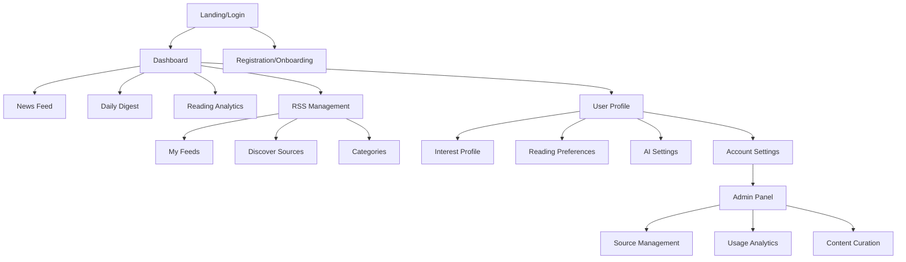
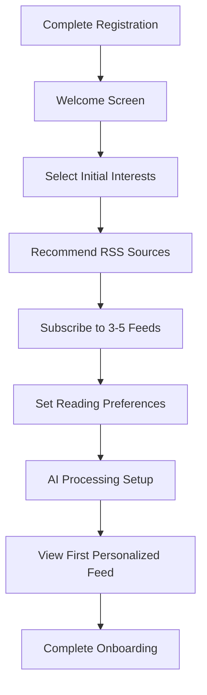
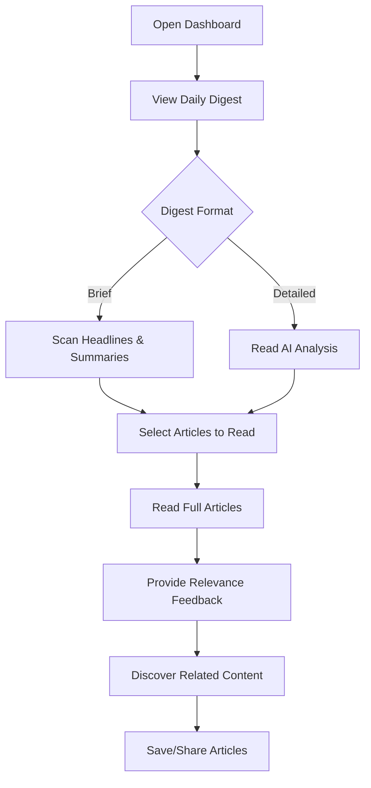
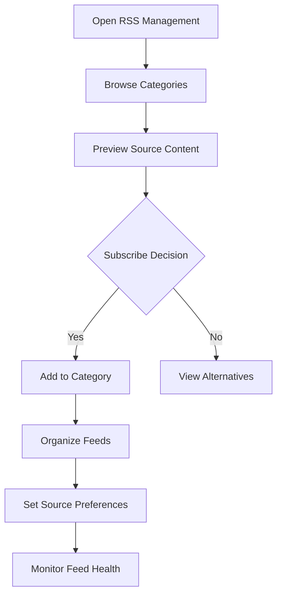

# Magnet UI/UX Specification

## Introduction

This document defines the user experience goals, information architecture, user flows, and visual design specifications for Magnet's user interface. It serves as the foundation for visual design and frontend development, ensuring a cohesive and user-centered experience.

## Overall UX Goals & Principles

### Target User Personas

**Primary: Knowledge Workers & Professionals**
- Ages 28-50, college-educated professionals in consulting, finance, technology, research
- Currently overwhelmed by information volume from 10-50 RSS feeds
- Need efficient news consumption that supports professional decision-making and thought leadership
- Value quality, relevance, and time efficiency over entertainment

**Secondary: Engaged Citizens & Researchers**
- Academics, graduate students, policy researchers, civic leaders
- High information needs across multiple domains with emphasis on accuracy and depth
- Value cross-topic synthesis, historical context, and primary source tracking
- Prefer research-grade organization and comprehensive understanding

### Usability Goals

- **Efficiency of Learning:** New users can set up personalized news consumption within 10 minutes of onboarding
- **Information Processing Speed:** Users can scan and process their daily news in 40% less time than traditional RSS readers
- **Relevance Accuracy:** AI recommendations achieve 85% user satisfaction rate within 2 weeks of usage
- **Cognitive Load Reduction:** Interface reduces information overwhelm through progressive disclosure and intelligent summarization
- **Cross-Device Consistency:** Users can seamlessly transition between desktop and mobile without losing context

### Design Principles

1. **Synthesis Over Aggregation** - Transform overwhelming information streams into digestible, relevant insights
2. **Intelligence Made Transparent** - AI features should enhance understanding, not replace user control
3. **Progressive Information Disclosure** - Show summaries first, allow drill-down when users want deeper context
4. **Professional Efficiency Focus** - Optimize for knowledge workers who need to stay informed while maintaining productivity
5. **Adaptive Personalization** - Interface evolves with user behavior while maintaining familiar patterns

### Change Log
| Date | Version | Description | Author |
|------|---------|-------------|---------|
| 2025-09-24 | 1.0 | Initial UI/UX specification from PRD analysis | Sally (UX Expert) |

## Information Architecture (IA)

### Site Map / Screen Inventory

### Navigation Structure

**Primary Navigation:** Dashboard, RSS Management, Profile - persistent sidebar for quick access to main sections

**Secondary Navigation:** Contextual tabs within each section (My Feeds/Discover in RSS Management, Interest Profile/Settings in User Profile)

**Breadcrumb Strategy:** Hierarchical breadcrumbs for deep navigation states, especially in RSS source organization and admin functions

## User Flows

### Critical Flow 1: First-Time User Onboarding

**User Goal:** Set up personalized news consumption within 10 minutes

**Entry Points:** Registration completion, welcome email

**Success Criteria:** User has selected interests, subscribed to 5+ feeds, seen first AI summary

#### Flow Diagram

#### Edge Cases & Error Handling:
- No interests selected: Provide popular defaults, allow skipping
- RSS feed subscription failures: Show alternatives, allow manual entry
- Slow AI processing: Show loading states, provide non-AI fallback

**Notes:** Onboarding should feel progressive and educational, not overwhelming

### Critical Flow 2: Daily News Consumption

**User Goal:** Efficiently consume relevant daily news in minimal time

**Entry Points:** Dashboard login, mobile app open, digest notification

**Success Criteria:** User scans digest, reads 3-5 articles, provides feedback

#### Flow Diagram

#### Edge Cases & Error Handling:
- No new articles: Show yesterday's digest, suggest feed expansion
- AI processing failure: Provide basic chronological feed
- Slow loading: Progressive loading with skeleton states

**Notes:** Core value delivery flow - must be optimized for speed and relevance

### Critical Flow 3: RSS Source Discovery & Management

**User Goal:** Find and organize high-quality information sources

**Entry Points:** RSS Management section, source recommendations, search

**Success Criteria:** User discovers relevant sources, organizes feeds, manages subscriptions

#### Flow Diagram

#### Edge Cases & Error Handling:
- Invalid RSS URL: Validate and suggest corrections
- Duplicate subscriptions: Detect and merge with existing
- Feed becomes unavailable: Notify user, suggest alternatives

**Notes:** Critical for user acquisition and retention - must balance discovery with organization

## Wireframes & Mockups

**Primary Design Files:** Figma workspace at [design-system-link] (to be created)

### Key Screen Layouts

#### Dashboard/News Feed
**Purpose:** Primary news consumption interface with AI-enhanced content discovery

**Key Elements:**
- Personalized daily digest card with key insights
- Article feed with toggle between tabular/tile views
- Smart filtering (category, date, unread, relevance)
- Article cards showing headline, summary, source, relevance score
- Progressive disclosure for article previews and full content

**Interaction Notes:** Infinite scroll with lazy loading, swipe gestures for mobile relevance feedback

**Design File Reference:** [dashboard-frame-link]

#### RSS Source Management
**Purpose:** Comprehensive source discovery, subscription, and organization

**Key Elements:**
- Three-tab interface (My Feeds, Discover, Categories)
- Source cards with health indicators and subscription controls
- Category-based browsing with popularity metrics
- Drag-and-drop organization interface
- Bulk management tools for feed maintenance

**Interaction Notes:** Preview modal for source evaluation, batch selection for management actions

**Design File Reference:** [rss-management-frame-link]

#### User Interest Profile
**Purpose:** Transparent AI personalization control with user agency

**Key Elements:**
- Visual interest map showing learned topics and confidence levels
- Manual interest adjustment controls with priority weighting
- Interest evolution timeline showing preference changes
- Privacy controls for data collection and AI learning
- Import/export options for interest profiles

**Interaction Notes:** Tag-based interest editing, slider controls for topic priorities

**Design File Reference:** [profile-frame-link]

## Component Library / Design System

**Design System Approach:** Custom design system built on shadcn/ui foundation, optimized for information-dense professional interfaces

### Core Components

#### ArticleCard
**Purpose:** Consistent article presentation across all views

**Variants:** Compact (list view), Expanded (tile view), Digest (summary view)

**States:** Unread, Read, Saved, Loading, Error, AI Processing

**Usage Guidelines:** Always include source attribution, publication time, and relevance indicators

#### AIInsightBadge
**Purpose:** Transparent indication of AI-generated content and confidence

**Variants:** Summary, Relevance Score, Category, Recommendation

**States:** High Confidence, Medium Confidence, Low Confidence, Processing

**Usage Guidelines:** Provide clear explanations for all AI decisions, allow user override

#### FeedSourceCard
**Purpose:** RSS source representation with health and subscription status

**Variants:** Subscribed, Available, Preview, Admin

**States:** Healthy, Warning, Error, Updating, Offline

**Usage Guidelines:** Consistent health indicators, clear subscription actions

#### SmartFilter
**Purpose:** Intelligent filtering that learns from user behavior

**Variants:** Category, Date Range, Relevance, Custom

**States:** Default, Active, Learning, Disabled

**Usage Guidelines:** Show filter logic, allow manual override of smart defaults

## Branding & Style Guide

### Visual Identity
**Brand Guidelines:** Clean, professional design emphasizing information clarity and cognitive ease

### Color Palette
| Color Type | Hex Code | Usage |
|------------|----------|-------|
| Primary | #2563eb | Key actions, AI indicators, focus states |
| Secondary | #64748b | Secondary text, borders, inactive states |
| Accent | #0ea5e9 | Relevance indicators, notification badges |
| Success | #22c55e | Feed health, positive feedback, confirmations |
| Warning | #f59e0b | Feed issues, moderate confidence, attention |
| Error | #ef4444 | Critical errors, failed feeds, destructive actions |
| Neutral | #f8fafc, #e2e8f0, #334155 | Backgrounds, text hierarchy, subtle elements |

### Typography

#### Font Families
- **Primary:** Inter (clean, professional, excellent readability)
- **Secondary:** System fonts fallback for performance
- **Monospace:** JetBrains Mono for code/technical content

#### Type Scale
| Element | Size | Weight | Line Height |
|---------|------|--------|-------------|
| H1 | 2.25rem | 700 | 1.2 |
| H2 | 1.875rem | 600 | 1.3 |
| H3 | 1.5rem | 600 | 1.4 |
| Body | 1rem | 400 | 1.6 |
| Small | 0.875rem | 400 | 1.5 |

### Iconography
**Icon Library:** Lucide React (consistent, professional, optimized for web)

**Usage Guidelines:** 24px default size, consistent stroke width, semantic meaning priority

### Spacing & Layout
**Grid System:** CSS Grid with 12-column layout, responsive breakpoints

**Spacing Scale:** 4px base unit (4, 8, 12, 16, 24, 32, 48, 64, 96px)

## Accessibility Requirements

### Compliance Target
**Standard:** WCAG 2.1 AA compliance for inclusive professional tool access

### Key Requirements

**Visual:**
- Color contrast ratios: 4.5:1 minimum for normal text, 3:1 for large text
- Focus indicators: Visible 2px outline with high contrast
- Text sizing: Support up to 200% zoom without horizontal scrolling

**Interaction:**
- Keyboard navigation: Full functionality without mouse, logical tab order
- Screen reader support: Semantic markup, ARIA labels, live region updates
- Touch targets: Minimum 44px for mobile interactions

**Content:**
- Alternative text: Descriptive alt text for all informative images
- Heading structure: Proper h1-h6 hierarchy for content organization
- Form labels: Clear, descriptive labels associated with all inputs

### Testing Strategy
Automated testing with axe-core, manual testing with screen readers (NVDA, JAWS), keyboard-only navigation testing, color contrast validation

## Responsiveness Strategy

### Breakpoints
| Breakpoint | Min Width | Max Width | Target Devices |
|------------|-----------|-----------|----------------|
| Mobile | 320px | 767px | Smartphones, small tablets |
| Tablet | 768px | 1023px | Tablets, small laptops |
| Desktop | 1024px | 1439px | Laptops, desktop monitors |
| Wide | 1440px | - | Large monitors, ultrawide displays |

### Adaptation Patterns

**Layout Changes:** Single column mobile → two column tablet → three column desktop with sidebar

**Navigation Changes:** Bottom tab bar mobile → sidebar tablet/desktop, hamburger menu for secondary navigation

**Content Priority:** AI summaries prominent on mobile, full articles accessible on larger screens

**Interaction Changes:** Swipe gestures mobile, hover states desktop, keyboard shortcuts for power users

## Animation & Micro-interactions

### Motion Principles
Subtle, purposeful animations that enhance understanding without distraction. Focus on state transitions, loading feedback, and progressive disclosure.

### Key Animations
- **Content Loading:** Skeleton shimmer effect (Duration: 800ms, Easing: ease-out)
- **Article Expand:** Smooth height transition (Duration: 300ms, Easing: ease-in-out)
- **Relevance Feedback:** Pulse animation on rating (Duration: 200ms, Easing: ease-out)
- **Filter Application:** Fade transition for content updates (Duration: 400ms, Easing: ease-in-out)
- **AI Processing:** Gentle rotation for processing indicators (Duration: 2s, Easing: linear loop)

## Performance Considerations

### Performance Goals
- **Page Load:** < 2 seconds for initial dashboard load
- **Interaction Response:** < 100ms for immediate feedback
- **Animation FPS:** Consistent 60fps for all animations

### Design Strategies
Progressive image loading, virtual scrolling for large feeds, skeleton states during AI processing, optimized font loading, minimal animation complexity

## Next Steps

### Immediate Actions
1. Create detailed mockups in Figma based on this specification
2. Validate information architecture with user testing or stakeholder review
3. Begin component library development with shadcn/ui foundation
4. Establish design tokens for consistent implementation
5. Plan user research sessions to validate key assumptions
6. Coordinate with development team on technical feasibility

### Design Handoff Checklist
- [x] All user flows documented
- [x] Component inventory complete
- [x] Accessibility requirements defined
- [x] Responsive strategy clear
- [x] Brand guidelines incorporated
- [x] Performance goals established